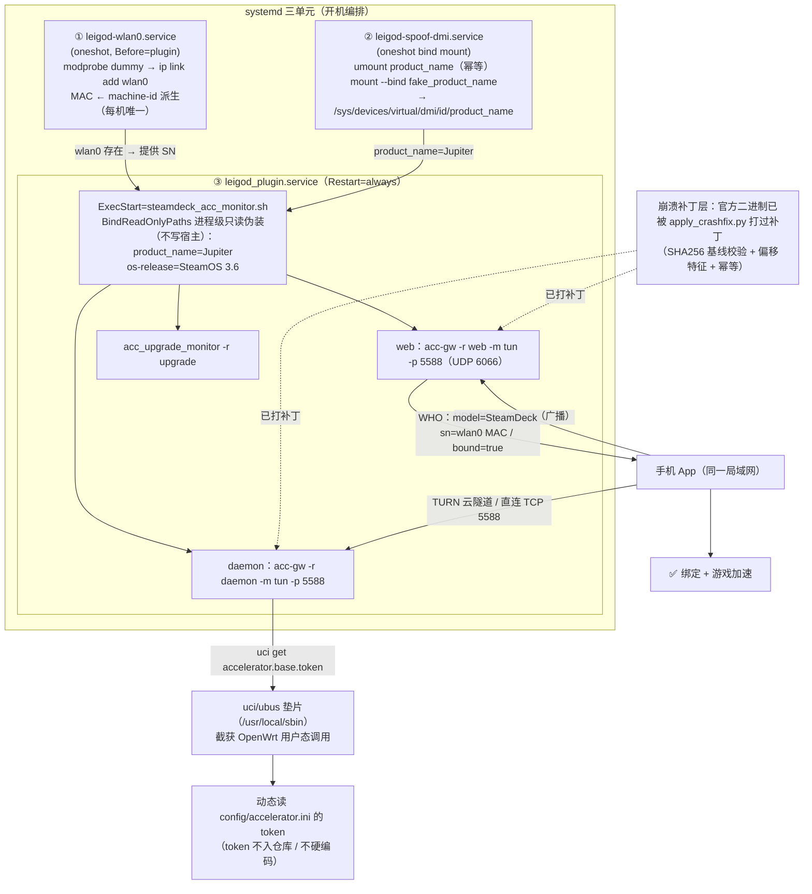

# leigod-for-bazzite

> 对不可变 Linux 系统友好的雷神加速器组件：一键伪装 SteamDeck、二进制崩溃补丁、傻瓜桌面面板。

在 Bazzite / SteamOS / Fedora Atomic 等只读根文件系统上，把雷神加速器（`acc-gw`）跑成可用的"盒子"：
手机 App 绑定 → 游戏加速。解决三个核心痛点——**系统非路由器无 uci/ubus、无 `wlan0` 网卡导致设备不可见、官方二进制遇纯 HTTP 请求必崩**。

---

## 快速开始

```bash
git clone https://github.com/xiyin/leigod-for-bazzite.git
cd leigod-for-bazzite

sudo ./install.sh            # 一键安装（默认装到 /opt/leigod）
```

安装完成后：

1. 桌面出现「雷神加速器」图标，双击查看运行状态 / 一键免密重启；
2. 手机装雷神加速器 App，连**同一局域网**，打开 App 绑定设备并加速；
3. 首次成功加速后，本机会写入绑定 token；**后续重装/换机可用 `--mac` 迁移保留绑定**。

### 常用参数

```bash
sudo ./install.sh --mac e8:4e:ce:12:34:56     # 沿用旧设备的 MAC（保留原绑定，换机迁移用）
sudo ./install.sh --token-file ./token.txt    # 首次安装即导入 token（文件里是 token= 行）
sudo ./install.sh --dir /home/deck/leigod     # 自定义安装目录
sudo ./install.sh --force                     # 覆盖已有 config（丢绑定，慎用）
sudo ./uninstall.sh                           # 卸载（保留安装目录便于回滚）
sudo ./uninstall.sh --purge                   # 卸载并删除安装目录
```

> 需要先安装依赖：`yad`（桌面面板）与 `curl python3`。Bazzite 用 `rpm-ostree install yad`，SteamOS 用 `sudo pacman -S yad`（见下方依赖表）。

---

## 伪装架构流程



### 为什么需要这三层伪装

| 现实差异 | 雷神期待（路由器/SteamDeck） | 本仓库方案 |
|---|---|---|
| Bazzite 网卡叫 `wlp7s0` | 读 `/sys/class/net/wlan0/address` 当设备 SN | dummy `wlan0`，MAC 由 machine-id 派生（每机唯一） |
| 无 ubusd / uci | daemon 调 `uci get accelerator.base.token` | `/usr/local/sbin/{uci,ubus}` shim 动态读 ini |
| DMI 名 `B650M K` | 必须 `Jupiter` 才走 SteamDeck 分支 | bind mount 伪装 + `BindReadOnlyPaths` 进程级只读 |
| 官方二进制裸 HTTP 打 5588 必崩 | websocketpp 状态机缺陷 | 本地 10 字节补丁（见下） |

---

## 崩溃补丁说明

官方二进制（`acc-gw.router.amd64`，SHA256 `8e0adb…`）存在缺陷：
**纯 HTTP + 非空 Host 头**访问 TCP 5588 → `websocketpp::exception "invalid state"` → SIGABRT，**100% 必崩**（复现 10/10，每次落 core）。

任何健康检查、端口扫描、误连 5588 的客户端都会触发。本仓库不 rehost 二进制，而是由 `install.sh` 从官方源下载后本地打补丁：

```bash
python3 patch/apply_crashfix.py <official_binary> <output_binary>
```

- 偏移 `0x172937`：官方 `bf 09 00 00 00`（mov edi,9 进崩溃路径）→ 修复 `31 c0 31 d2 90×6`（安全返回）；
- 先校验 SHA256 是否匹配官方基线，不匹配即中止并提示上报新偏移（官方改版自动发现）；
- 幂等：对已补丁文件重复执行直接返回 `already_patched`；
- 产物 md5 `b1c3b473…`，补丁后纯 HTTP ×10 全 404 存活、WS 101/绑定/加速均不受影响（补丁与功能正交）。

---

## 依赖

| 依赖 | 用途 | Bazzite 安装 | SteamOS 安装 |
|---|---|---|---|
| `curl` | 下载官方组件 | 预装 | 预装 |
| `python3` | 崩溃补丁脚本 | 预装 | 预装 |
| `yad` | 桌面状态面板（可选） | `rpm-ostree install yad` | `sudo pacman -S yad` |
| `sudo` | install/uninstall | 预装 | 预装 |

系统要求：**x86_64**、Linux（Bazzite/Fedora Atomic/SteamOS 实测可用；OpenWrt/路由器请用官方脚本）。

---

## 目录结构

```
leigod-for-bazzite/
├── install.sh                  # 一键安装（下载→补丁→伪装→三服务→面板）
├── uninstall.sh                # 卸载 / 回滚
├── patch/apply_crashfix.py     # 崩溃补丁（SHA256 基线 + 特征扫描 + 幂等）
├── files/
│   ├── fake_product_name       # "Jupiter"
│   ├── fake_os-release         # SteamOS 3.6 伪装
│   ├── steamdeck_acc_monitor.sh# 守护（daemon+web+upgrade 自愈, /proc 扫描防 D 进程拖死）
│   └── config/                 # accelerator.ini / acc_version.ini / 升级配置模板
├── shims/
│   ├── uci                     # 动态 token 读取垫片（token 不入库）
│   └── ubus                    # 空实现垫片
├── systemd/                    # 三单元模板（@INSTALL_DIR@/@FAKE_DIR@/@MAC@）
├── panel/                      # yad 状态面板 + desktop 模板
├── LICENSE                     # MIT
└── README.md
```

---

## 免责声明

- 本项目为**个人研究/学习用途**，与雷神加速器官方无任何关联，不提供加速服务本身；
- 崩溃补丁仅修正二进制在本机暴露的缺陷；**修改第三方二进制可能违反其服务条款**，风险自负；
- 伪造成 SteamDeck 设备可能违反平台/服务商规则，请勿用于商业或违规用途；
- token/绑定信息仅存本机，仓库不含任何用户数据；使用即视为已知悉以上条款。

---

## 相关说明

- **绑定迁移**：手机绑定状态与设备 `wlan0` MAC 强相关。换机/重装想保留绑定 → 用旧机 `ip link show wlan0` 的 MAC 加 `--mac` 安装；不指定则每机由 machine-id 派生新 MAC（需重新绑定）。
- **崩溃回归**：若日后官方源更新二进制导致补丁中止，脚本会打印新版本偏移，欢迎提 issue 反馈。
- 详细排查过程（9 轮取证→修复→绑定成功）见记忆与 `docs/`（施工中）。
