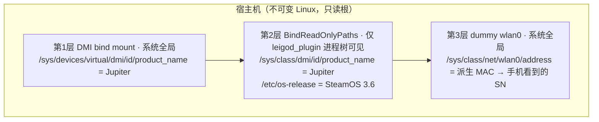
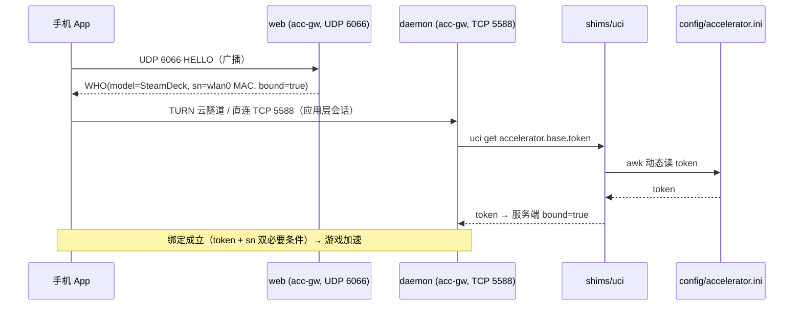

# 架构说明

## 问题域

雷神 `acc-gw` 是为 OpenWrt 路由器 / SteamDeck 编写的加速"盒子"守护进程。在 Bazzite 等不可变桌面 Linux 上运行会遇到三类不兼容：

1. **硬件身份不匹配** — 雷神只把 `product_name=Jupiter`(SteamDeck) 当作可支持设备分支；普通台式机主板型号会被拒。
2. **网卡命名差异** — 雷神读 `/sys/class/net/wlan0/address` 作为设备 SN/MAC；systemd 可预测命名下实际网卡是 `wlp7s0` 之类，导致设备对手机"不可见"。
3. **OpenWrt 用户态依赖** — daemon 调 `uci get accelerator.base.token` 与 `ubus call ...`；普通 Linux 没有这些。
4. **官方二进制崩溃缺陷** — 纯 HTTP + 非空 Host 头打 TCP 5588 → websocketpp 状态机异常 → SIGABRT（100% 复现）。

## 组件职责

| 组件 | 职责 | 关键点 |
|---|---|---|
| `systemd/leigod-wlan0.service` | 开机建 dummy `wlan0` | MAC = `02:` + machine-id md5 前 10 位（每机唯一、可 `--mac` 覆盖迁移） |
| `systemd/leigod-spoof-dmi.service` | bind mount `fake_product_name`(Jupiter) 到 DMI | 真实路径 `/sys/devices/virtual/dmi/id/product_name`（**不是** `/sys/class/dmi/id/...` 符号链接，systemd 会拒绝非 canonical 路径） |
| `systemd/leigod_plugin.service` | 跑守护脚本 | `BindReadOnlyPaths` 给**进程视角**再伪装 `product_name` + `/etc/os-release`(SteamOS 3.6)；不污染宿主 |
| `files/steamdeck_acc_monitor.sh` | 进程守护自愈 | 自身目录推导安装路径；`/proc` 扫描代替 `pidof`（D 进程卡死 `/proc` 时 pidof 会被拖死）；单例锁 `/var/run/acc_daemon.lock`；幂等补 wlan0 |
| `shims/uci` | OpenWrt uci 垫片 | `uci get accelerator.base.token` → 动态 awk 读 `INSTALL_DIR/config/accelerator.ini`；token 不入库不硬编码 |
| `shims/ubus` | OpenWrt ubus 垫片 | 一律回 `{}`（web 进程诊断性调用空实现规避） |
| `patch/apply_crashfix.py` | 二进制崩溃补丁 | 官方基线 SHA256 校验 + 偏移特征比对 + 幂等；产物 md5 `b1c3b473` |
| `panel/leigod_panel.py` | yad 桌面面板 | 双击看状态 / 免密强制重启（sudoers.d 单条白名单） |

## 伪装层次



雷神 web 进程启动时输出：

```
product_name is:Jupiter
is steamdeck, brand:SteamDeck, model:SteamDeck
board init success
```

## 数据流



设备"绑定"成立的两个必要条件（排查中实证）：
- **token**：服务端 `bound=true`（由 uci shim 提供真实 token 解决）；
- **sn**：手机可见并保持绑定（由 dummy wlan0 提供 MAC 解决）。

## 崩溃补丁位置

- 偏移 `0x172937`，10 字节控制流：
  - 官方：`bf 09 00 00 00 e8 4a fd fe ff`（mov edi,9 → 进崩溃路径）
  - 修复：`31 c0 31 d2 90 90 90 90 90 90`（xor 清寄存器 → 状态检查走安全返回）
- 官方版 SHA256 `8e0adb…` / 补丁版 `0dba34…` / md5 `b1c3b473…`
- 官方源更新二进制 → sha256 不匹配 → 脚本中止打印新偏移（防静默打错）。
